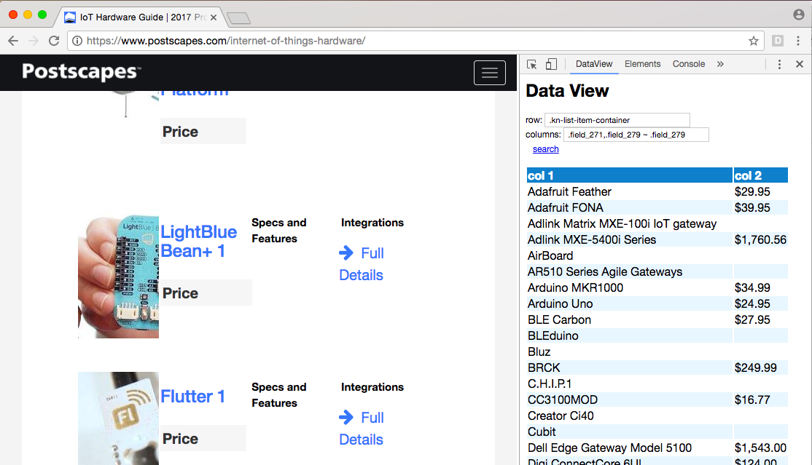

# data-view
Chrome Devtools plugin - custom views for page data

This is a project to take structured HTML content and display it in a way that might provide greater insight or easier comprehension.

# setting up

1. Go to chrome://extensions
1. make sure "Developer mode" is turned on
1. Click "Load unpacked extension..." and pick the folder of this project
1. Open developer tools
1. There should now be a tab for the "DataView" panel

# using

1. Open developer tools and select the DataView tab
1. Enter a css selector in the "row" input field
1. Enter a list of comma-separated css selectors in the "columns" input field (these must be contained in the row selector)
1. Click "search"
1. If everything worked, there should be a sortable table with the text of the selected elements

# debugging

open developer tools in its own window and then press opt-cmd-i again from there to open a second developer tools window for the DataView panel
